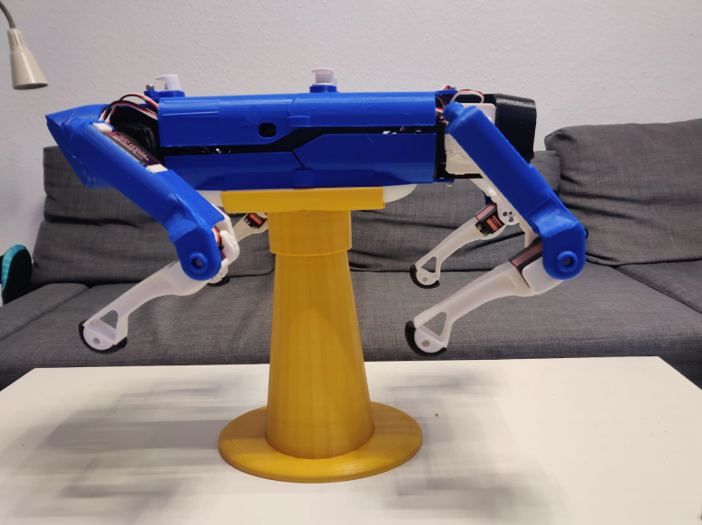

# Nova Spot Micro

A quadruped robot inspired by Boston Dynamics Spot, built from scratch as part of a bachelor project at the Institute for Robotics and Cognitive Systems, University of Lübeck.

## What We Built

The robot is a fully functional four-legged platform based on the open-source [Spot Micro](https://spotmicroai.readthedocs.io/) design. The focus of our work was on the complete hardware build and a significant electronics redesign. Consolidating the original two-microcontroller architecture down to a single **Arduino Nano RP2040**, simplifying both the wiring and the codebase, and replacing the PS2 controller with a Wi-Fi web interface.

## Hardware

- **3D printing**: ~60 hours of printing across all structural parts (legs, torso frame and covers), post-processed by hand — support removal, heat-fitting of bearings, nuts, and servo horns
- **Servos**: 12x servo motors, 35 kg/cm torque for tibia joints
- **Custom PCB**: designed in Fritzing, hand-soldered on double-sided perfboard; integrates all connectors for servos, sensors, and power rails in a compact layout that fits inside the robot body
- **Sensors**: MPU6050 IMU (accelerometer + gyroscope), 2x ultrasonic sensors, 3x PIR motion sensors with 3D-printed 120° caps
- **Power**: 2200 mAh LiPo (11V) → 6.8V buck converter (servos) → 5V buck converter (Arduino), with separate kill switches for full power and PWM controller

## Electronics Redesign

The original design splits control between a Teensy 4.0 (master) and an Arduino Nano (slave). We eliminated the Teensy entirely and ran the full control stack on a single **Arduino Nano RP2040**, which offers dual-core ARM Cortex-M0+, built-in Wi-Fi/Bluetooth, a 6-axis IMU, and TinyML support, which is enough headroom for all robot functions in one board.

## Control

Instead of a physical controller, the robot hosts its own Wi-Fi access point. Connecting to it opens a web interface (served directly from the Arduino at `192.168.4.1`) with buttons for predefined movements, servo speed control, and sensor toggles. Movement commands route through the existing `serial-commands` function, keeping the code clean and making it easy to add new gaits.

## Tech Stack

- **Microcontroller**: Arduino Nano RP2040 Connect
- **Firmware**: Arduino (C++), WifiNINA library
- **PCB design**: Fritzing
- **Key ICs**: PCA9865 PWM controller (I2C), MPU6050 IMU (I2C)

## Contributors

Lukas Bruns & Yasin Kirschstein — University of Lübeck, supervised by Prof. Dr. Floris Ernst
